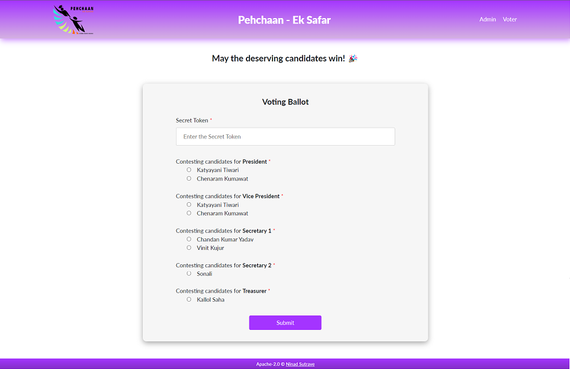
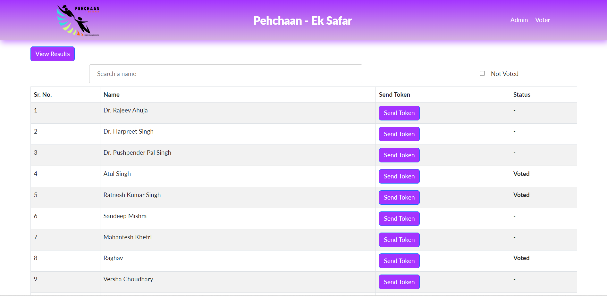

# Voting Ballot

## Description

This platform was primarily developed for the Governing Body Elections of [Pehchaan - Ek Safar](www.iitrpr.ac.in/pehchaanes/index.php), an NGO run by IIT Ropar students aiming to educate the underprivileged. It was executed successfully with great performance for ~100 voters.

## Features

✓ 100% Anonymous Voting 

✓ Admin has entire control over the portal

✓ Admin sends a secret token to the voter via an automated EMail

✓ Admin can view results at the end and declare them

## Preview

## Possible Additions

 - Send an Email of Confirmation after voting
 - Produce pictorial results in form of bar chart
 
## Visit the Website

https://pehchaan.netlify.app/

The application may be used for future elections of Pehchaan, and thus the admin access is restricted.

## License

Apache-2.0 © Ninad Sutrave
